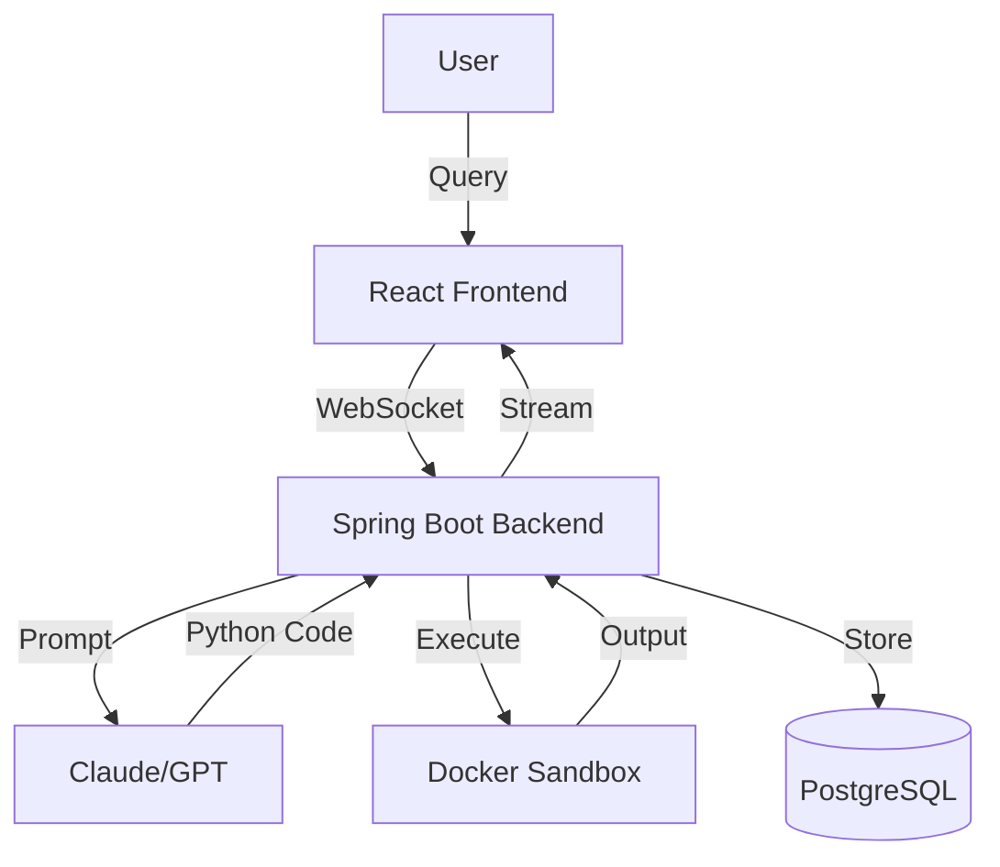

# MY Manus - AI Agent Platform with CodeAct Architecture

> A transparent AI agent platform where agents write and execute Python code to solve complex tasks, inspired by Manus AI's interface and powered by CodeAct architecture.


## 🎯 What is MY Manus?

MY Manus is an open-source implementation of an autonomous AI agent platform that uses the revolutionary CodeAct architecture. Unlike traditional agent systems that rely on rigid API calls, MY Manus agents write and execute Python code to accomplish tasks, providing complete transparency through real-time visualization of their work.

### Key Features

- **🧠 CodeAct Architecture**: Agents write Python code instead of calling JSON APIs, achieving 20% better performance
- **👁️ Transparent Execution**: Eight-panel interface with real-time visualization (Chat, Terminal, Editor, Browser, Events, Files, Replay, Knowledge, Plan)
- **🔒 Secure Sandboxing**: All code runs in isolated Docker containers with strict resource limits
- **🔧 Extensible Tools**: 20 built-in tools with hybrid system (core infrastructure tools + dynamic MCP tool discovery)
- **💾 State Persistence**: Variables and context persist between code executions
- **🚀 Production Ready**: Configurable authentication, rate limiting, and horizontal scaling
- **🎬 Session Replay**: Record and replay agent sessions with time-travel debugging
- **🧠 RAG/Knowledge Base**: Upload documents for semantic search and context augmentation
- **🌐 Enhanced Browser**: Multi-tab browsing with console logs and network monitoring
- **🔔 Real-Time Notifications**: Browser notifications and in-app notification center with priority levels
- **📋 Live Plan Visualization**: Real-time task tracking synchronized with todo.md files
- **💬 Multi-Turn Conversations**: Intelligent LLM-based message classification for parallel query handling
- **📊 Observability**: Comprehensive Prometheus metrics for monitoring and analytics

## 🏗️ Architecture Overview



## 🚀 Quick Start

### Prerequisites

- Java 17+
- Node.js 22.13+
- Docker Desktop
- PostgreSQL 15+
- 8GB RAM minimum

### Installation

1. **Clone the repository**
```bash
git clone https://github.com/yourusername/my-manus.git
cd my-manus
```

2. **Start PostgreSQL**
```bash
docker run -d \
  --name mymanus-db \
  -e POSTGRES_DB=mymanus \
  -e POSTGRES_USER=mymanus \
  -e POSTGRES_PASSWORD=mymanus \
  -p 5432:5432 \
  postgres:15
```

3. **Configure environment**
```bash
# Backend configuration
cp backend/.env.example backend/.env
# Edit backend/.env with your API keys

# Frontend configuration  
cp frontend/.env.example frontend/.env
```

4. **Run the backend**
```bash
cd backend
./mvnw spring-boot:run -Dspring.profiles.active=dev
```

5. **Run the frontend**
```bash
cd frontend
npm install
npm run dev
```

6. **Access the application**
```
http://localhost:3000
```

## 🎮 Usage

### Basic Interaction

1. **Ask the agent to solve a problem**
```
"Analyze the sentiment of recent news about AI and create a visualization"
```

2. **Watch the agent work**
   - See Python code being written in the Editor panel
   - Observe execution in the Terminal panel
   - View results and visualizations in the Browser panel

3. **Agent writes code like**
```python
# Agent's generated code appears here
import requests
from textblob import TextBlob
import matplotlib.pyplot as plt

# Fetch news data
news = fetch_ai_news()

# Analyze sentiment
sentiments = []
for article in news:
    blob = TextBlob(article['title'])
    sentiments.append(blob.sentiment.polarity)

# Create visualization
plt.figure(figsize=(10, 6))
plt.hist(sentiments, bins=20)
plt.title('AI News Sentiment Distribution')
plt.xlabel('Sentiment Score')
plt.ylabel('Frequency')
plt.savefig('sentiment_analysis.png')
print("Analysis complete! Saved visualization.")
```

### Available Commands

When using with Claude Code:
- `START` - Initialize project structure
- `AGENT` - Build core agent loop
- `UI` - Create the interface
- `SANDBOX` - Setup execution environment
- `TOOLS [name]` - Add new tools
- `TEST` - Run all tests

## 🛠️ Core Components

### Backend (Spring Boot)
- **CodeActAgentService**: Orchestrates the agent loop
- **PythonSandboxExecutor**: Secure code execution
- **ToolRegistry**: Manages available tools
- **WebSocketController**: Real-time updates

### Frontend (React + TypeScript)
- **ChatPanel**: Conversation interface
- **TerminalView**: Command execution display
- **EditorView**: Code editing with Monaco
- **BrowserView**: Web content rendering

### Sandbox (Docker)
- Ubuntu 22.04 base image
- Python 3.11 with data science stack
- Node.js 22.13 for JavaScript tools
- FFmpeg, Poppler for media processing
- Isolated network and filesystem

## 🔧 Configuration

### Development Mode
```yaml
# application-dev.yml
auth:
  enabled: false
logging:
  level: DEBUG
```

### Production Mode
```yaml
# application-prod.yml
auth:
  enabled: true
  jwt:
    secret: ${JWT_SECRET}
rate-limit:
  requests: 100
  window: 3600
```

## 📚 Documentation

### Getting Started
- [QUICKSTART.md](QUICKSTART.md) - 5-minute quick start guide
- [SETUP.md](SETUP.md) - Comprehensive setup instructions
- [CLAUDE.md](CLAUDE.md) - Development instructions for Claude Code

### Guides
- [Agent Guide](docs/guides/AGENT_GUIDE.md) - CodeAct implementation details
- [UI Guide](docs/guides/UI_GUIDE.md) - Frontend development patterns
- [Sandbox Guide](docs/guides/SANDBOX_GUIDE.md) - Environment setup and configuration
- [Tools Guide](docs/guides/TOOLS_GUIDE.md) - Adding and customizing tools
- [Deployment Guide](docs/guides/DEPLOYMENT.md) - Production deployment strategies

### Architecture
- [Frontend Architecture](docs/architecture/FRONTEND_ARCHITECTURE.md) - Complete UI layout and component structure
- [Sandbox Architecture](docs/architecture/SANDBOX_ARCHITECTURE.md) - Docker sandbox design

### Project Documentation
- [Differential Analysis](docs/project/DIFFERENTIAL_ANALYSIS.md) - Comparison with Manus AI
- [Implementation Status](docs/project/IMPLEMENTATION_STATUS.md) - Feature completion tracking
- [Final Summary](docs/project/FINAL_SUMMARY.md) - Project completion summary

### Research
- [Manus AI Research Report](docs/research/MANUS_AI_RESEARCH_REPORT.md) - Original research and analysis

## 🧪 Testing

```bash
# Backend tests
cd backend
./mvnw test

# Frontend tests
cd frontend
npm test

# Integration tests
./scripts/integration-test.sh

# Security tests
./scripts/security-test.sh
```

## 🚢 Deployment

### Docker Compose (Development)
```bash
docker-compose up -d
```

### Kubernetes (Production)
```bash
kubectl apply -f k8s/
```

### Environment Variables
```bash
DB_HOST=localhost
DB_NAME=mymanus
ANTHROPIC_API_KEY=your-key-here
AUTH_ENABLED=false  # true in production
JWT_SECRET=your-secret-here
```

## 🤝 Contributing

We welcome contributions! Please see [CONTRIBUTING.md](CONTRIBUTING.md) for details.

### Development Workflow
1. Fork the repository
2. Create a feature branch
3. Make your changes
4. Add tests
5. Submit a pull request

## 📊 Performance

- **Task Success Rate**: 85%+
- **Average Response Time**: <2 seconds
- **Code Execution**: <5 seconds
- **Memory Usage**: ~512MB per sandbox
- **Concurrent Users**: 100+ supported

## 🔐 Security

- All code execution in isolated Docker containers
- Resource limits enforced (CPU, memory, time)
- Input validation and sanitization
- JWT-based authentication (production)
- Rate limiting per user
- Audit logging for compliance

## 🗺️ Roadmap

### Phase 1 - Core Infrastructure ✅ Complete
- ✅ Basic CodeAct loop
- ✅ Docker sandboxing
- ✅ Eight-panel UI (Chat, Terminal, Editor, Browser, Events, Files, Replay, Knowledge, Plan)
- ✅ 20 core tools

### Phase 2 - Enhanced Features ✅ Complete
- ✅ Multi-agent orchestration (6 specialized roles)
- ✅ Browser automation with Playwright
- ✅ Enhanced browser tabs (Console, Network monitoring)
- ✅ Session replay with time-travel debugging
- ✅ File tree visualization

### Phase 3 - Advanced Features ✅ Complete
- ✅ RAG/Knowledge base integration
- ✅ Real-time notifications (browser + in-app)
- ✅ Live plan visualization
- ✅ Multi-turn conversation support
- ✅ Hybrid tool system (Core + MCP dynamic discovery)
- ✅ Comprehensive observability (Prometheus metrics)

### Phase 4 - Future Enhancements
- ⏳ Plugin marketplace
- ⏳ Custom tool creation UI
- ⏳ Team collaboration features
- ⏳ Mobile app support
- ⏳ Advanced analytics dashboards
- ⏳ Cost tracking and optimization

## 🙏 Acknowledgments

- Inspired by [Manus AI](https://manus.im) interface design
- CodeAct architecture from [ICML 2024 paper](https://arxiv.org/abs/2402.01030)
- Built with Spring Boot, React, Docker, and PostgreSQL
- Powered by Anthropic Claude and OpenAI GPT models

## 📄 License

MIT License - see [LICENSE](LICENSE) file for details.

## 💬 Support

- **Documentation**: [docs/](docs/)
- **Issues**: [GitHub Issues](https://github.com/yourusername/my-manus/issues)
- **Discussions**: [GitHub Discussions](https://github.com/yourusername/my-manus/discussions)
- **Email**: support@mymanus.ai

## 🌟 Star History

If you find MY Manus useful, please consider giving it a star! ⭐

---

**MY Manus** - Where AI agents write code to solve your problems transparently.

Built with ❤️ for the AI community.
