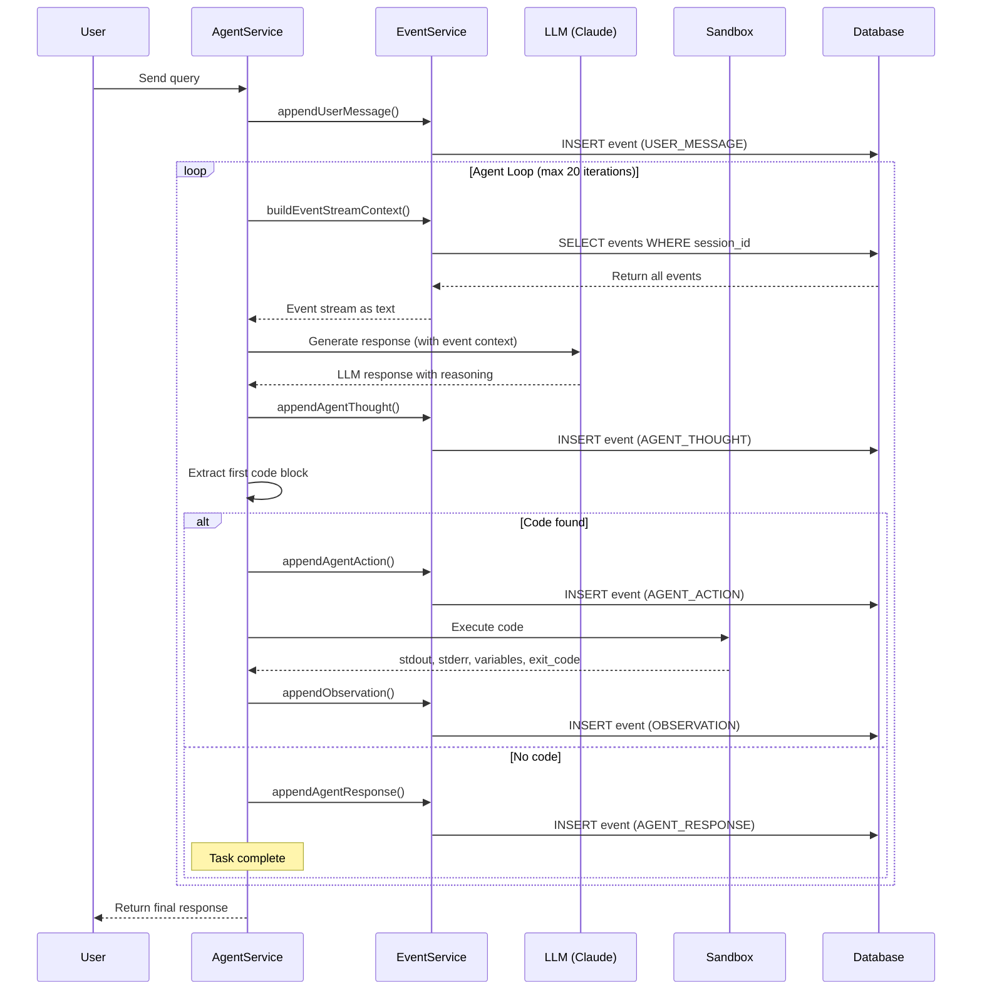

# Event Stream Architecture Guide

**Version:** 1.0
**Date:** November 2025
**Pattern:** Manus AI Event Stream

---

## Table of Contents

1. [What is Event Stream?](#what-is-event-stream)
2. [Why Event Stream?](#why-event-stream)
3. [Event Types](#event-types)
4. [Event Flow](#event-flow)
5. [Implementation](#implementation)
6. [Usage Patterns](#usage-patterns)
7. [Best Practices](#best-practices)
8. [Examples](#examples)
9. [Debugging with Events](#debugging-with-events)
10. [Performance Considerations](#performance-considerations)

---

## What is Event Stream?

### Definition

The **Event Stream** is an **immutable, chronological log** of everything that happens during agent execution. Every user message, agent thought, action, and observation is captured as a discrete event and stored in PostgreSQL.

**Pattern Formula:**
```
Event Stream = [Event₀, Event₁, Event₂, ..., Eventₙ]

Where each event captures:
- WHAT happened (type)
- WHEN it happened (timestamp)
- WHERE in the process (iteration + sequence)
- WHY it happened (context in content)
- HOW it turned out (success/failure, duration)
```

### Core Concept

```
User Query  →  [Event: USER_MESSAGE]
                      ↓
            LLM Thinking  →  [Event: AGENT_THOUGHT]
                      ↓
            Code Generated  →  [Event: AGENT_ACTION]
                      ↓
            Code Executed  →  [Event: OBSERVATION]
                      ↓
            (Repeat until done)
                      ↓
            Final Answer  →  [Event: AGENT_RESPONSE]
```

**Key Properties:**

1. **Immutable**: Events never change once written
2. **Ordered**: Strict chronological sequence (iteration + sequence number)
3. **Complete**: Captures ALL agent behavior
4. **Queryable**: Can filter, search, and analyze
5. **Reproducible**: Can replay entire session from events

---

## Why Event Stream?

### Benefits

**1. Complete Transparency**
```
❌ Black Box: LLM → Answer (no visibility)
✅ Event Stream: LLM → Thought → Action → Result → Answer (full visibility)
```

**2. Debugging**
```
Problem: "Why did the agent fail at iteration 5?"

With Event Stream:
- See exact user message
- See agent's reasoning (thought)
- See exact code executed (action)
- See error message (observation)
- See all previous context

Without Event Stream:
- "It just failed" (no details)
```

**3. Auditability**
```
Compliance Question: "What did the agent do on Nov 25 at 10:15 AM?"

Event Stream Answer:
iteration=1: Read customer data from CRM
iteration=2: Calculated pricing discount
iteration=3: Sent email notification
iteration=4: Updated database record
```

**4. Reproducibility**
```
Feature: Session Replay

Given event stream, we can:
- Reconstruct agent state at any iteration
- "Time-travel" to debug specific points
- Understand decision-making process
- Learn from successful patterns
```

**5. Analytics**
```
Business Intelligence:
- Which tools are used most?
- What's the average success rate?
- Where do agents get stuck?
- How long does each action take?

All answerable via event stream queries!
```

### Comparison: Event Stream vs Traditional Logging

| Aspect | Traditional Logs | Event Stream |
|--------|------------------|--------------|
| **Structure** | Unstructured text | Structured events (DB) |
| **Queryability** | grep/awk | SQL queries |
| **Ordering** | Timestamp only | iteration + sequence |
| **Relationships** | None | Foreign keys |
| **Context** | Scattered | Grouped by session |
| **Replay** | Impossible | Built-in |
| **Analytics** | Hard | Easy (SQL aggregations) |

---

## Event Types

### 7 Core Event Types

```java
public enum EventType {
    USER_MESSAGE,      // User sends query to agent
    AGENT_THOUGHT,     // LLM generates reasoning
    AGENT_ACTION,      // LLM decides on action (code to execute)
    OBSERVATION,       // Result of action execution
    AGENT_RESPONSE,    // Final answer to user
    SYSTEM,            // System messages (status updates)
    ERROR              // Errors during execution
}
```

### Event Type Details

#### 1. USER_MESSAGE

**Purpose:** Capture user's input query

**When:** At start of agent loop (iteration 0)

**Structure:**
```json
{
  "type": "USER_MESSAGE",
  "iteration": 0,
  "sequence": 0,
  "content": "Analyze sales data in data.csv",
  "data": {
    "message_length": 32,
    "timestamp_received": "2025-11-25T10:00:00Z"
  },
  "success": true
}
```

**Code:**
```java
Event event = Event.builder()
    .type(Event.EventType.USER_MESSAGE)
    .iteration(0)
    .content(userMessage)
    .build();
```

---

#### 2. AGENT_THOUGHT

**Purpose:** Capture LLM's reasoning before taking action

**When:** After each LLM generation

**Structure:**
```json
{
  "type": "AGENT_THOUGHT",
  "iteration": 1,
  "sequence": 0,
  "content": "I'll first read the CSV file to understand the structure. Then I'll calculate totals and create a visualization.",
  "data": {
    "model": "claude-3-5-sonnet",
    "tokens_used": 150,
    "temperature": 0.7
  },
  "success": true
}
```

**Example Thought Content:**
```
I need to analyze the sales data. My plan:
1. Read data.csv using pandas
2. Check data structure and missing values
3. Calculate total sales by product
4. Create a bar chart visualization
5. Save the chart to file

Let me start by reading the CSV...
```

---

#### 3. AGENT_ACTION

**Purpose:** Capture the code/tool the agent decides to execute

**When:** After extracting code block from LLM response

**Structure:**
```json
{
  "type": "AGENT_ACTION",
  "iteration": 1,
  "sequence": 1,
  "content": "import pandas as pd\ndf = pd.read_csv('data.csv')\nprint(df.head())",
  "data": {
    "tool": "execute_code",
    "language": "python",
    "code_length": 68,
    "code_preview": "import pandas as pd\ndf = pd.read_csv('data.csv')..."
  },
  "success": true
}
```

**Code:**
```java
Event event = Event.builder()
    .type(Event.EventType.AGENT_ACTION)
    .iteration(iteration)
    .content(pythonCode)
    .data(Map.of(
        "tool", "execute_code",
        "language", "python",
        "code_length", pythonCode.length()
    ))
    .build();
```

---

#### 4. OBSERVATION

**Purpose:** Capture results of action execution

**When:** After code executes in sandbox

**Structure:**
```json
{
  "type": "OBSERVATION",
  "iteration": 1,
  "sequence": 2,
  "content": "   Product  Sales  Region\n0  Widget    1500  North\n1  Gadget    2300  South\n2  Sprocket  1800  East",
  "data": {
    "stdout": "...",
    "stderr": "",
    "variables": {
      "df": {"_type": "DataFrame", "_shape": [100, 5]}
    },
    "exit_code": 0
  },
  "success": true,
  "duration_ms": 850
}
```

**Failed Observation:**
```json
{
  "type": "OBSERVATION",
  "iteration": 2,
  "sequence": 2,
  "content": "",
  "data": {
    "stdout": "",
    "stderr": "FileNotFoundError: [Errno 2] No such file or directory: 'data.csv'",
    "exit_code": 1
  },
  "success": false,
  "error": "FileNotFoundError: [Errno 2] No such file or directory: 'data.csv'",
  "duration_ms": 45
}
```

---

#### 5. AGENT_RESPONSE

**Purpose:** Final answer to user's query

**When:** When agent determines task is complete

**Structure:**
```json
{
  "type": "AGENT_RESPONSE",
  "iteration": 5,
  "sequence": 0,
  "content": "I've analyzed the sales data. Here are the key findings:\n\n1. Total sales: $150,000\n2. Top product: Gadget ($56,000)\n3. Best region: South\n\nThe visualization has been saved to sales_chart.png.",
  "data": {
    "summary": true,
    "artifacts_created": ["sales_chart.png"]
  },
  "success": true
}
```

---

#### 6. SYSTEM

**Purpose:** System-level messages and status updates

**When:** Configuration changes, status updates, metadata

**Structure:**
```json
{
  "type": "SYSTEM",
  "iteration": 0,
  "sequence": 1,
  "content": "Session initialized with claude-3-5-sonnet model",
  "data": {
    "model": "claude-3-5-sonnet",
    "max_iterations": 20,
    "sandbox_mode": "docker"
  },
  "success": true
}
```

---

#### 7. ERROR

**Purpose:** Capture errors that prevent continuation

**When:** Unrecoverable errors occur

**Structure:**
```json
{
  "type": "ERROR",
  "iteration": 3,
  "sequence": 0,
  "content": "Failed to connect to Anthropic API",
  "data": {
    "error_type": "NetworkError",
    "status_code": 503,
    "retry_count": 3,
    "stackTrace": "..."
  },
  "success": false,
  "error": "Failed to connect to Anthropic API"
}
```

---

## Event Flow

### Complete Event Flow Diagram



### Iteration Structure

Each iteration follows this pattern:

```
Iteration N:
  seq=0: AGENT_THOUGHT    (LLM reasoning)
  seq=1: AGENT_ACTION     (Code to execute)
  seq=2: OBSERVATION      (Execution result)
```

**Example Event Stream:**

```
iteration=0, sequence=0: USER_MESSAGE
  "Analyze sales data in data.csv"

iteration=1, sequence=0: AGENT_THOUGHT
  "I'll read the CSV first to see the structure"

iteration=1, sequence=1: AGENT_ACTION
  "df = pd.read_csv('data.csv'); print(df.head())"

iteration=1, sequence=2: OBSERVATION
  "   Product  Sales  Region\n0  Widget    1500  North..."
  [duration_ms: 850, success: true]

iteration=2, sequence=0: AGENT_THOUGHT
  "Now I'll calculate totals by product"

iteration=2, sequence=1: AGENT_ACTION
  "totals = df.groupby('Product')['Sales'].sum(); print(totals)"

iteration=2, sequence=2: OBSERVATION
  "Widget     4200\nGadget     5600..."
  [duration_ms: 120, success: true]

iteration=3, sequence=0: AGENT_THOUGHT
  "Finally, I'll create a visualization"

iteration=3, sequence=1: AGENT_ACTION
  "plt.bar(totals.index, totals.values); plt.savefig('chart.png')"

iteration=3, sequence=2: OBSERVATION
  "Chart saved successfully"
  [duration_ms: 450, success: true]

iteration=4, sequence=0: AGENT_RESPONSE
  "Analysis complete! See chart.png for visualization."
```

---

## Implementation

### EventService Class

**Location:** `backend/src/main/java/ai/mymanus/service/EventService.java`

**Key Methods:**

```java
@Service
public class EventService {

    // Append methods for each event type
    Event appendUserMessage(String sessionId, String message, int iteration)
    Event appendAgentThought(String sessionId, String thought, int iteration)
    Event appendAgentAction(String sessionId, String actionType, String actionContent, Map<String, Object> actionData, int iteration)
    Event appendObservation(String sessionId, String observation, Map<String, Object> observationData, boolean success, String error, long durationMs, int iteration)
    Event appendAgentResponse(String sessionId, String response, int iteration)
    Event appendSystem(String sessionId, String message, int iteration)
    Event appendError(String sessionId, String errorMessage, Map<String, Object> errorData, int iteration)

    // Query methods
    List<Event> getEventStream(String sessionId)
    List<Event> getEventsForIteration(String sessionId, int iteration)
    String buildEventStreamContext(String sessionId)

    // Utility methods
    int getNextSequence(UUID agentStateId, int iteration)
    void clearEventStream(String sessionId)
}
```

### Building Event Stream Context

**Key Pattern:** Convert events to text for LLM context

```java
public String buildEventStreamContext(String sessionId) {
    List<Event> events = getEventStream(sessionId);
    StringBuilder context = new StringBuilder();

    for (Event event : events) {
        context.append(formatEvent(event)).append("\n\n");
    }

    return context.toString();
}

private String formatEvent(Event event) {
    return String.format("""
        %s (iteration %d):
        %s
        """,
        event.getType(),
        event.getIteration(),
        event.getContent()
    );
}
```

**Output Example:**

```
USER_MESSAGE (iteration 0):
Analyze sales data in data.csv

AGENT_THOUGHT (iteration 1):
I'll first read the CSV to understand the structure...

AGENT_ACTION (iteration 1):
```python
import pandas as pd
df = pd.read_csv('data.csv')
print(df.head())
```

OBSERVATION (iteration 1):
   Product  Sales  Region
0  Widget    1500  North
1  Gadget    2300  South
```

### Database Schema

```sql
CREATE TABLE events (
    id                  UUID PRIMARY KEY,
    agent_state_id      UUID REFERENCES agent_states(id),
    type                VARCHAR(50) NOT NULL,
    iteration           INTEGER NOT NULL,
    sequence            INTEGER NOT NULL,
    content             TEXT,
    data                JSONB,
    timestamp           TIMESTAMP DEFAULT CURRENT_TIMESTAMP,
    duration_ms         BIGINT,
    success             BOOLEAN DEFAULT true,
    error               TEXT,

    -- Critical index for queries
    INDEX idx_events_session_iter (agent_state_id, iteration, sequence)
);
```

---

## Usage Patterns

### Pattern 1: Append Events During Execution

```java
public String processQuery(String sessionId, String userQuery) {
    // 1. Append user message
    eventService.appendUserMessage(sessionId, userQuery, 0);

    // 2. Agent loop
    for (int iteration = 1; iteration <= maxIterations; iteration++) {
        // 2a. Get event context
        String context = eventService.buildEventStreamContext(sessionId);

        // 2b. Generate LLM response
        String llmResponse = llmService.generate(context);

        // 2c. Append thought
        eventService.appendAgentThought(sessionId, llmResponse, iteration);

        // 2d. Extract code
        String code = extractCode(llmResponse);

        if (code == null) {
            // No code, task complete
            eventService.appendAgentResponse(sessionId, llmResponse, iteration);
            break;
        }

        // 2e. Append action
        eventService.appendAgentAction(sessionId, "execute_code", code, metadata, iteration);

        // 2f. Execute code
        ExecutionResult result = sandboxExecutor.execute(sessionId, code);

        // 2g. Append observation
        eventService.appendObservation(
            sessionId,
            result.getStdout(),
            result.toMap(),
            result.isSuccess(),
            result.getError(),
            result.getDurationMs(),
            iteration
        );
    }

    return getFinalResponse(sessionId);
}
```

### Pattern 2: Query Event Stream

```java
// Get all events for session
List<Event> events = eventService.getEventStream(sessionId);

// Get events for specific iteration
List<Event> iterationEvents = eventService.getEventsForIteration(sessionId, 3);

// Find failed observations
List<Event> failedActions = events.stream()
    .filter(e -> e.getType() == EventType.OBSERVATION)
    .filter(e -> !e.getSuccess())
    .collect(Collectors.toList());

// Calculate average execution time
double avgDuration = events.stream()
    .filter(e -> e.getDurationMs() != null)
    .mapToLong(Event::getDurationMs)
    .average()
    .orElse(0.0);
```

### Pattern 3: Session Replay

```java
public Map<String, Object> replayToIteration(String sessionId, int targetIteration) {
    List<Event> events = eventService.getEventStream(sessionId);

    Map<String, Object> state = new HashMap<>();

    for (Event event : events) {
        if (event.getIteration() > targetIteration) {
            break;  // Stop at target iteration
        }

        if (event.getType() == EventType.OBSERVATION && event.getSuccess()) {
            // Restore Python variables from this observation
            Map<String, Object> variables = (Map<String, Object>) event.getData().get("variables");
            state.putAll(variables);
        }
    }

    return state;  // State at target iteration
}
```

---

## Best Practices

### 1. Always Append Events

❌ **Bad:**
```java
// Execute without logging
ExecutionResult result = sandbox.execute(code);
return result;
```

✅ **Good:**
```java
// Append action BEFORE execution
eventService.appendAgentAction(sessionId, "execute_code", code, metadata, iteration);

// Execute
ExecutionResult result = sandbox.execute(code);

// Append observation AFTER execution
eventService.appendObservation(sessionId, result.getStdout(), result.toMap(),
    result.isSuccess(), result.getError(), result.getDurationMs(), iteration);

return result;
```

### 2. Include Rich Metadata

❌ **Bad:**
```java
eventService.appendAgentAction(sessionId, "code", code, Map.of(), iteration);
```

✅ **Good:**
```java
Map<String, Object> metadata = Map.of(
    "tool", "execute_code",
    "language", "python",
    "code_length", code.length(),
    "code_preview", code.substring(0, Math.min(100, code.length())),
    "libraries_used", detectLibraries(code)
);
eventService.appendAgentAction(sessionId, "execute_code", code, metadata, iteration);
```

### 3. Capture Duration

❌ **Bad:**
```java
ExecutionResult result = execute(code);
appendObservation(sessionId, result, iteration);  // No duration
```

✅ **Good:**
```java
long startTime = System.currentTimeMillis();
ExecutionResult result = execute(code);
long duration = System.currentTimeMillis() - startTime;

appendObservation(sessionId, result.getStdout(), result.toMap(),
    result.isSuccess(), result.getError(), duration, iteration);
```

### 4. Handle Errors Properly

❌ **Bad:**
```java
try {
    ExecutionResult result = execute(code);
    appendObservation(sessionId, result, true, null, duration, iteration);
} catch (Exception e) {
    // Error lost!
    throw e;
}
```

✅ **Good:**
```java
try {
    ExecutionResult result = execute(code);
    appendObservation(sessionId, result.getStdout(), result.toMap(),
        result.isSuccess(), result.getError(), duration, iteration);
} catch (Exception e) {
    appendError(sessionId, e.getMessage(), Map.of("stackTrace", e.getStackTrace()), iteration);
    throw e;
}
```

### 5. Use Transactions

❌ **Bad:**
```java
public void processAction() {
    appendAction(...);  // Might fail
    ExecutionResult result = execute(...);  // Might fail
    appendObservation(...);  // Might fail
    // Inconsistent state if any step fails!
}
```

✅ **Good:**
```java
@Transactional
public void processAction() {
    appendAction(...);
    try {
        ExecutionResult result = execute(...);
        appendObservation(...);
    } catch (Exception e) {
        appendError(...);
        throw e;  // Rollback entire transaction
    }
}
```

---

## Examples

### Example 1: Simple Data Analysis Session

**Event Stream:**

```json
[
  {
    "type": "USER_MESSAGE",
    "iteration": 0,
    "content": "Calculate average sales",
    "timestamp": "2025-11-25T10:00:00"
  },
  {
    "type": "AGENT_THOUGHT",
    "iteration": 1,
    "content": "I'll read the sales data and calculate the average.",
    "timestamp": "2025-11-25T10:00:02"
  },
  {
    "type": "AGENT_ACTION",
    "iteration": 1,
    "content": "df = pd.read_csv('sales.csv'); avg = df['sales'].mean(); print(f'Average: ${avg:.2f}')",
    "timestamp": "2025-11-25T10:00:03"
  },
  {
    "type": "OBSERVATION",
    "iteration": 1,
    "content": "Average: $2456.78",
    "duration_ms": 350,
    "success": true,
    "timestamp": "2025-11-25T10:00:03.350"
  },
  {
    "type": "AGENT_RESPONSE",
    "iteration": 2,
    "content": "The average sales amount is $2,456.78.",
    "timestamp": "2025-11-25T10:00:05"
  }
]
```

### Example 2: Failed Execution with Recovery

```json
[
  {
    "type": "USER_MESSAGE",
    "iteration": 0,
    "content": "Read config.json and print settings"
  },
  {
    "type": "AGENT_ACTION",
    "iteration": 1,
    "content": "import json; data = json.load(open('config.json')); print(data)"
  },
  {
    "type": "OBSERVATION",
    "iteration": 1,
    "success": false,
    "error": "FileNotFoundError: [Errno 2] No such file or directory: 'config.json'",
    "duration_ms": 45
  },
  {
    "type": "AGENT_THOUGHT",
    "iteration": 2,
    "content": "The file doesn't exist. I'll create a default config first."
  },
  {
    "type": "AGENT_ACTION",
    "iteration": 2,
    "content": "default_config = {'env': 'dev', 'debug': True}; json.dump(default_config, open('config.json', 'w'))"
  },
  {
    "type": "OBSERVATION",
    "iteration": 2,
    "success": true,
    "content": "Config file created",
    "duration_ms": 120
  },
  {
    "type": "AGENT_RESPONSE",
    "iteration": 3,
    "content": "I created a default config.json with dev settings."
  }
]
```

---

## Debugging with Events

### Debug Pattern 1: Find Where It Failed

```sql
-- Find the iteration where execution failed
SELECT iteration, content, error
FROM events
WHERE agent_state_id = (SELECT id FROM agent_states WHERE session_id = 'session-123')
  AND success = false
ORDER BY iteration;
```

### Debug Pattern 2: Reconstruct Full Context

```sql
-- See everything that happened before the failure
SELECT type, iteration, sequence, content, success
FROM events
WHERE agent_state_id = (SELECT id FROM agent_states WHERE session_id = 'session-123')
  AND iteration <= 5
ORDER BY iteration, sequence;
```

### Debug Pattern 3: Analyze Performance

```sql
-- Find slowest operations
SELECT
    iteration,
    type,
    content,
    duration_ms
FROM events
WHERE agent_state_id = (SELECT id FROM agent_states WHERE session_id = 'session-123')
  AND duration_ms IS NOT NULL
ORDER BY duration_ms DESC
LIMIT 10;
```

---

## Performance Considerations

### 1. Index Properly

```sql
-- Critical composite index
CREATE INDEX idx_events_session_iter
ON events (agent_state_id, iteration, sequence);

-- For JSONB queries
CREATE INDEX idx_events_data
ON events USING GIN (data);
```

### 2. Limit Event Stream Context

**Problem:** Sending 1000s of events to LLM wastes tokens

**Solution:** Truncate old events

```java
public String buildEventStreamContext(String sessionId, int maxEvents) {
    List<Event> events = getEventStream(sessionId);

    // Keep last N events only
    if (events.size() > maxEvents) {
        events = events.subList(events.size() - maxEvents, events.size());
    }

    return formatEvents(events);
}
```

### 3. Use Lazy Loading

```java
@ManyToOne(fetch = FetchType.LAZY)  // Don't load AgentState unless needed
@JoinColumn(name = "agent_state_id")
private AgentState agentState;
```

### 4. Batch Queries

❌ **Bad:**
```java
for (int i = 1; i <= 20; i++) {
    List<Event> events = getEventsForIteration(sessionId, i);  // 20 queries!
}
```

✅ **Good:**
```java
List<Event> allEvents = getEventStream(sessionId);  // 1 query
Map<Integer, List<Event>> byIteration = allEvents.stream()
    .collect(Collectors.groupingBy(Event::getIteration));
```

---

## Summary

Event Stream is the **foundation of MY-Manus transparency**:

✅ **Immutable audit log** of all agent behavior
✅ **Complete transparency** for debugging
✅ **Session replay** capability
✅ **Analytics-ready** data structure
✅ **Production-proven** pattern from Manus AI

**Key Takeaway:** Every agent action MUST flow through the event stream. No shortcuts.

---

## Next Steps

**Explore More:**
- [Architecture Overview →](ARCHITECTURE.md)
- [Database Schema →](DATABASE_SCHEMA.md)
- [API Reference →](../guides/API_REFERENCE.md)

**Query Events:**
```bash
psql -U postgres -d mymanus

SELECT type, iteration, content
FROM events
WHERE agent_state_id = (SELECT id FROM agent_states WHERE session_id = 'your-session-id')
ORDER BY iteration, sequence;
```

---

**Document Version:** 1.0
**Last Updated:** November 2025
**Next:** [Observability Guide →](OBSERVABILITY.md)
