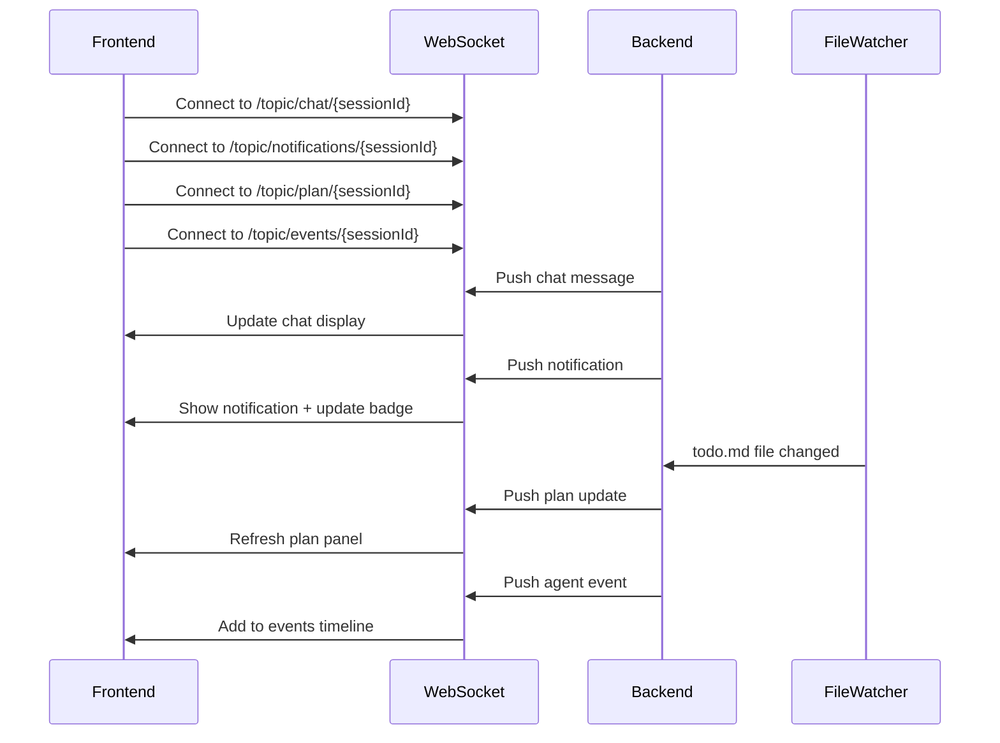
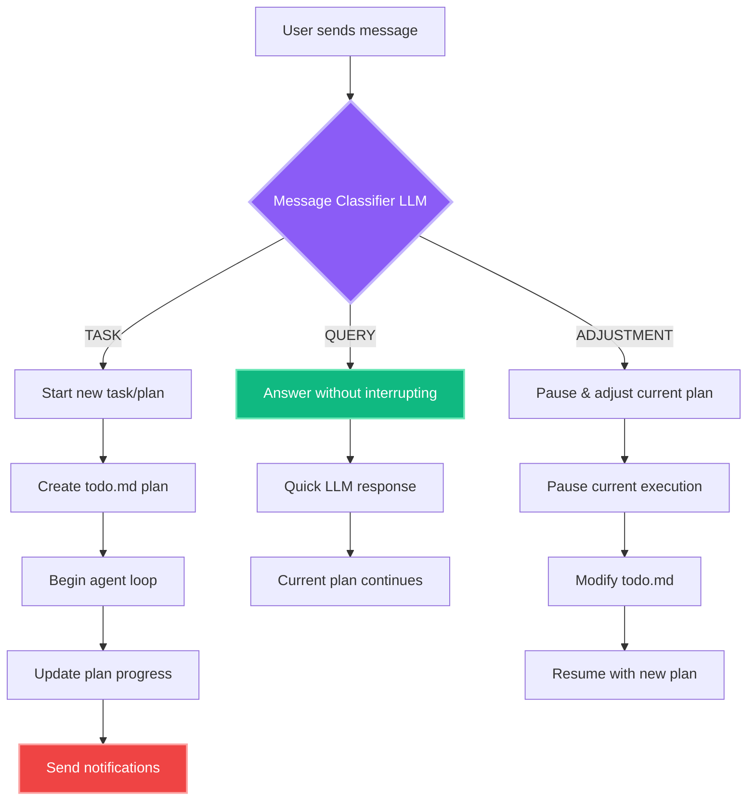
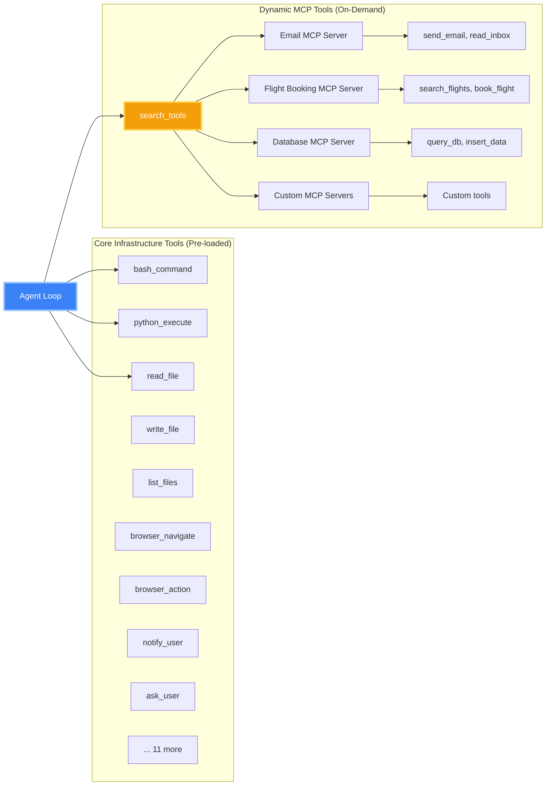

# MY-Manus Frontend Architecture

## Complete UI Layout Wireframe

```mermaid
graph TB
    subgraph "Main Application Layout"
        Header[Header Component]
        MainLayout[Main Layout Container]

        subgraph "Header Section"
            Header --> Logo[MY-Manus Logo]
            Header --> SessionInfo[Session ID & Status]
            Header --> StatusIndicator[Connection Status]
            Header --> NotificationBell[🔔 Notification Bell with Badge]
        end

        subgraph "Main Content Area"
            MainLayout --> LeftSidebar[Left Sidebar - Chat List]
            MainLayout --> CenterPanel[Center - Chat Interface]
            MainLayout --> RightPanel[Right - Visualization Panels]

            subgraph "Left Sidebar - Multi-Chat"
                LeftSidebar --> NewChatBtn[+ New Chat Button]
                LeftSidebar --> ChatList[Active Chat Sessions List]
                ChatList --> Chat1[📝 Chat Session 1]
                ChatList --> Chat2[📝 Chat Session 2]
                ChatList --> Chat3[📝 Chat Session 3]
                ChatList --> MoreChats[... More Chats]
            end

            subgraph "Center Panel - Chat Interface"
                CenterPanel --> ChatHeader[Current Session Header]
                CenterPanel --> MessageArea[Message History]
                CenterPanel --> InputBox[User Input + Send Button]

                MessageArea --> UserMsg[User Messages]
                MessageArea --> AgentMsg[Agent Responses]
                MessageArea --> ToolExec[Tool Execution Blocks]
                MessageArea --> CodeBlocks[Code Execution Results]
            end

            subgraph "Right Panel - Tabbed Visualization"
                RightPanel --> PanelTabs[Panel Tab Bar]
                RightPanel --> PanelContent[Active Panel Content]

                PanelTabs --> TerminalTab[🖥️ Terminal]
                PanelTabs --> EditorTab[📝 Editor]
                PanelTabs --> BrowserTab[🌐 Browser]
                PanelTabs --> EventsTab[📊 Events]
                PanelTabs --> FilesTab[📁 Files]
                PanelTabs --> ReplayTab[⏮️ Replay]
                PanelTabs --> KnowledgeTab[🧠 Knowledge]
                PanelTabs --> PlanTab[📋 Plan]

                PanelContent --> Terminal[Terminal Output with xterm.js]
                PanelContent --> Editor[Code Editor with Monaco]
                PanelContent --> Browser[Enhanced Browser with Tabs]
                PanelContent --> Events[Agent Events Timeline]
                PanelContent --> Files[File System Explorer]
                PanelContent --> Replay[Session Replay Player]
                PanelContent --> Knowledge[RAG Knowledge Base]
                PanelContent --> Plan[Live Plan Visualization]
            end
        end

        subgraph "Notification Panel (Dropdown)"
            NotificationBell -.-> NotifPanel[Notification Dropdown Panel]
            NotifPanel --> NotifHeader[Unread Count + Mark All Read]
            NotifPanel --> NotifList[Notification List]
            NotifList --> TaskComplete[✅ Task Completed]
            NotifList --> TaskFailed[❌ Task Failed]
            NotifList --> AgentWaiting[⏸️ Agent Waiting]
            NotifList --> PlanAdjusted[🔄 Plan Adjusted]
            NotifList --> ToolError[⚠️ Tool Error]
            NotifList --> SystemNotif[🔧 System]
        end
    end

    subgraph "WebSocket Connections"
        WS1[/topic/chat/{sessionId}]
        WS2[/topic/notifications/{sessionId}]
        WS3[/topic/plan/{sessionId}]
        WS4[/topic/events/{sessionId}]

        WS1 --> MessageArea
        WS2 --> NotificationBell
        WS3 --> Plan
        WS4 --> Events
    end

    subgraph "Backend Services"
        API1[Chat API]
        API2[Notification API]
        API3[Plan API]
        API4[Tool API]
        API5[File API]
        API6[Knowledge API]

        CenterPanel <--> API1
        NotificationBell <--> API2
        Plan <--> API3
        Terminal <--> API4
        Files <--> API5
        Knowledge <--> API6
    end

    style Header fill:#1a1a1a,stroke:#4a9eff,stroke-width:2px,color:#fff
    style MainLayout fill:#0d1117,stroke:#4a9eff,stroke-width:2px,color:#fff
    style NotificationBell fill:#ef4444,stroke:#fca5a5,stroke-width:2px,color:#fff
    style Plan fill:#3b82f6,stroke:#93c5fd,stroke-width:2px,color:#fff
    style Knowledge fill:#8b5cf6,stroke:#c4b5fd,stroke-width:2px,color:#fff
    style Replay fill:#f59e0b,stroke:#fcd34d,stroke-width:2px,color:#fff
    style Browser fill:#10b981,stroke:#6ee7b7,stroke-width:2px,color:#fff
```

## Detailed Panel Descriptions

### 1. **Header Component**
- **Logo**: MY-Manus branding
- **Session Info**: Current session ID display
- **Connection Status**: Visual indicator (green/yellow/red) with status text
- **Notification Bell**:
  - Shows unread count badge
  - Click to open notification dropdown
  - Polls for updates every 10 seconds
  - Browser notification integration

### 2. **Left Sidebar - Multi-Chat**
- **New Chat Button**: Creates new chat session
- **Chat List**:
  - Displays all active chat sessions
  - Click to switch between chats
  - Shows session name/ID
  - Recent activity indicator
  - Delete/archive options

### 3. **Center Panel - Chat Interface**
- **Message History**:
  - User messages (right-aligned, blue)
  - Agent responses (left-aligned, gray)
  - Tool execution blocks with syntax highlighting
  - Code execution results with collapsible output
  - Streaming responses with real-time updates
- **Input Box**:
  - Multi-line text input
  - Send button
  - File attachment support
  - Keyboard shortcuts (Enter to send)

### 4. **Right Panel - Visualization Tabs**

#### 🖥️ **Terminal Panel**
- Real-time command execution output
- xterm.js integration
- Command history
- Syntax highlighting
- Auto-scroll with lock option

#### 📝 **Editor Panel**
- Monaco editor integration
- Syntax highlighting for 100+ languages
- File editing capabilities
- Save/revert options
- Line numbers and folding

#### 🌐 **Browser Panel** (Enhanced)
- Multiple tab support
- Tab management (new, close, switch)
- URL bar with navigation
- Refresh and history controls
- Iframe-based rendering
- Screenshot capture

#### 📊 **Events Panel**
- Real-time agent event timeline
- Event types:
  - Task started/completed
  - Tool executions
  - Code runs
  - Errors/warnings
  - User interactions
- Filterable by event type
- Expandable event details

#### 📁 **Files Panel**
- File system tree view
- File CRUD operations
- File preview
- Download/upload
- Search functionality
- Path navigation

#### ⏮️ **Replay Panel** (Session Replay)
- Timeline scrubber
- Play/pause controls
- Speed adjustment (0.5x, 1x, 2x, 4x)
- Jump to specific events
- Synchronized state replay:
  - Chat messages
  - Terminal output
  - Browser state
  - File changes
  - Editor content

#### 🧠 **Knowledge Panel** (RAG)
- Document upload interface
- Knowledge base viewer
- Search across documents
- Document metadata
- Relevance scoring
- Source citations
- CRUD operations on knowledge items

#### 📋 **Plan Panel** (NEW - Live Plan Visualization)
- **Progress Bar**: Overall completion percentage
- **Task List**:
  - ✅ Completed tasks (green border)
  - 🔄 In-progress task (blue border, animated)
  - ⏳ Pending tasks (gray border)
- **Plan Sections**:
  - Progress notes
  - Current status
  - Blockers/issues
  - Next steps
- **Live Updates**:
  - Real-time sync with todo.md file
  - FileWatcher triggers WebSocket updates
  - Instant UI reflection of plan changes
  - No manual refresh needed

### 5. **Notification Panel** (Dropdown)
- **Header**:
  - "Notifications" title
  - Unread count display
  - "Mark all read" button
  - Close button (X)
- **Notification List**:
  - Priority color-coded borders:
    - 🔴 URGENT (red)
    - 🟠 HIGH (orange)
    - 🔵 NORMAL (blue)
    - ⚫ LOW (gray)
  - Notification types with icons:
    - ✅ Task Completed
    - ❌ Task Failed
    - ⏸️ Agent Waiting for Input
    - 🔄 Plan Adjusted
    - ⚠️ Tool Error
    - 🔧 System Notification
    - ℹ️ Info
  - Time formatting (Just now, 5m ago, 3h ago, 2d ago)
  - Click to mark as read and navigate
  - Unread indicator dot
- **Empty State**: Friendly message when no notifications
- **Footer**: "View all notifications" link

## WebSocket Integration

### Real-Time Updates


## Multi-Turn Conversation Flow



## Tool System Architecture



## State Management (Zustand)

```typescript
interface AgentStore {
  // Session Management
  sessions: ChatSession[]
  currentSessionId: string | null
  createSession: () => void
  switchSession: (id: string) => void
  deleteSession: (id: string) => void

  // Connection State
  isConnected: boolean
  agentStatus: 'idle' | 'thinking' | 'executing' | 'waiting'

  // Panel Management
  activePanel: 'terminal' | 'editor' | 'browser' | 'events' |
                'files' | 'replay' | 'knowledge' | 'plan'
  setActivePanel: (panel: string) => void

  // Messages
  messages: Message[]
  addMessage: (message: Message) => void

  // Notifications
  unreadCount: number
  updateUnreadCount: (count: number) => void
}
```

## Responsive Design

- **Desktop (1920x1080+)**: Three-column layout
  - Left sidebar: 300px
  - Center chat: Flexible (40-50%)
  - Right panel: Flexible (30-40%)

- **Laptop (1366x768)**: Three-column layout (compressed)
  - Left sidebar: 250px
  - Center chat: Flexible (45%)
  - Right panel: Flexible (35%)

- **Tablet (768x1024)**: Two-column layout
  - Chat takes 60%
  - Panel takes 40%
  - Sidebar collapses to hamburger menu

- **Mobile (375x667)**: Single column
  - Stack all components vertically
  - Panels accessible via bottom tabs
  - Chat list in slide-out drawer

## Technology Stack

### Frontend
- **React 18** with TypeScript
- **Tailwind CSS** for styling
- **Zustand** for state management
- **Monaco Editor** for code editing
- **xterm.js** for terminal emulation
- **Mermaid** for diagram rendering
- **WebSocket** with STOMP.js for real-time updates
- **React Router** for navigation

### Backend
- **Spring Boot 3.3** with Java 21
- **Spring AI** for LLM integration
- **Spring WebSocket** for real-time communication
- **PostgreSQL** for data persistence
- **Docker** for sandbox execution
- **Prometheus** for metrics
- **Spring Boot Actuator** for observability

## Key Features Summary

1. ✅ **Multi-Chat Support** - Multiple concurrent chat sessions
2. ✅ **8 Visualization Panels** - Terminal, Editor, Browser, Events, Files, Replay, Knowledge, Plan
3. ✅ **Browser Notifications** - Desktop notifications with priority levels
4. ✅ **In-App Notifications** - Notification center with real-time updates
5. ✅ **Session Replay** - Full session recording and playback
6. ✅ **RAG Knowledge Base** - Document upload and semantic search
7. ✅ **Enhanced Browser** - Multi-tab browsing with full controls
8. ✅ **Live Plan Visualization** - Real-time plan tracking from todo.md
9. ✅ **Multi-Turn Conversations** - Intelligent message classification
10. ✅ **Hybrid Tool System** - Pre-loaded core + dynamic MCP tools
11. ✅ **Comprehensive Observability** - Prometheus metrics throughout
12. ✅ **Real-Time Updates** - WebSocket-based instant synchronization
