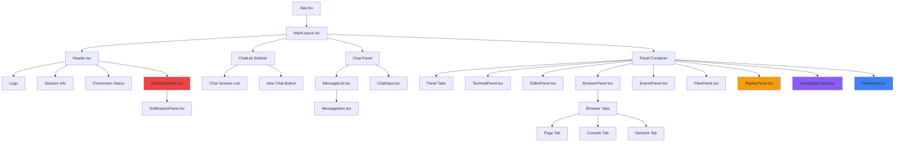
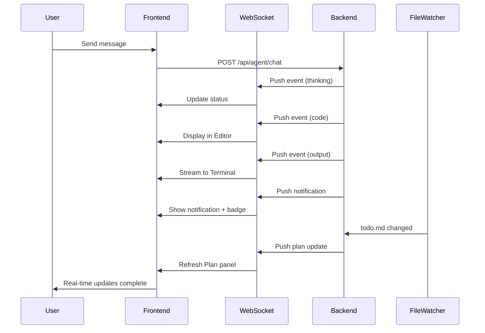
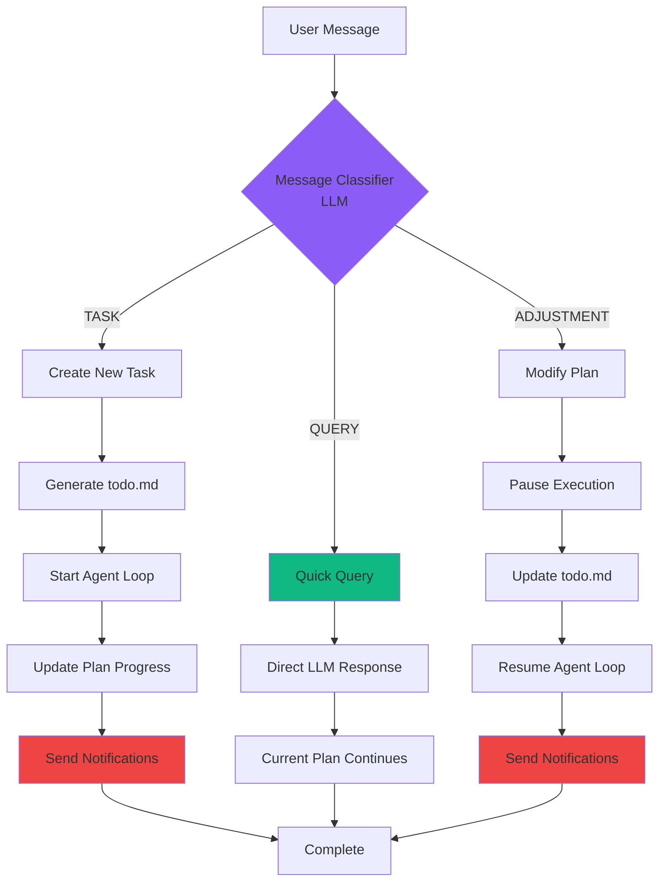

# MY-Manus Frontend Architecture

> Complete UI layout, component structure, and implementation details

**Last Updated**: 2025-11-25
**Status**: ✅ Fully Implemented

---

## Table of Contents

1. [UI Layout Overview](#ui-layout-overview)
2. [Component Architecture](#component-architecture)
3. [Panel Descriptions](#panel-descriptions)
4. [State Management](#state-management)
5. [Real-Time Communication](#real-time-communication)
6. [Technology Stack](#technology-stack)

---

## UI Layout Overview

### Main Layout Structure

```
┌─────────────────────────────────────────────────────────────────────┐
│  Header: Logo | Session Info | Status | 🔔 Notifications (badge)    │
├──────────────┬──────────────────────────┬──────────────────────────┤
│              │                          │  ┌────────────────────┐  │
│   Multi-     │                          │  │ Tabs:              │  │
│   Chat       │      Chat Interface      │  │ Terminal | Editor  │  │
│   List       │                          │  │ Browser | Events   │  │
│              │   ┌──────────────────┐   │  │ Files | Replay     │  │
│  • Chat 1    │   │  Message History │   │  │ Knowledge | Plan   │  │
│  • Chat 2    │   │  ┌────────────┐  │   │  ├────────────────────┤  │
│  • Chat 3    │   │  │ User:      │  │   │  │                    │  │
│  • ...       │   │  │ Query      │  │   │  │   Active Panel     │  │
│              │   │  └────────────┘  │   │  │   Content          │  │
│  + New       │   │  ┌────────────┐  │   │  │                    │  │
│   Chat       │   │  │ Agent:     │  │   │  │   (Real-time       │  │
│              │   │  │ Response   │  │   │  │    updates via     │  │
│              │   │  └────────────┘  │   │  │    WebSocket)      │  │
│              │   │  ┌────────────┐  │   │  │                    │  │
│              │   │  │ Code Block │  │   │  │                    │  │
│              │   │  └────────────┘  │   │  │                    │  │
│              │   └──────────────────┘   │  └────────────────────┘  │
│              │   ┌──────────────────┐   │                          │
│              │   │  [Input Box]     │   │                          │
│              │   │  [Send Button]   │   │                          │
│              │   └──────────────────┘   │                          │
│   (300px)    │        (40-50%)          │        (30-40%)          │
└──────────────┴──────────────────────────┴──────────────────────────┘
```

### Notification Dropdown (Overlay)

```
┌──────────────────────────────────────────┐
│  Notifications (5 unread) [Mark all read]│
├──────────────────────────────────────────┤
│  🔴 ✅ Task "Deploy backend" completed    │
│      2 minutes ago                    ❌ │
├──────────────────────────────────────────┤
│  🟠 ⏸️ Agent waiting for user input       │
│      5 minutes ago                    ❌ │
├──────────────────────────────────────────┤
│  🔵 🔄 Plan adjusted: Added 2 new tasks   │
│      1 hour ago                       ✓  │
├──────────────────────────────────────────┤
│  ⚫ ℹ️ Session replay available           │
│      3 hours ago                      ✓  │
└──────────────────────────────────────────┘
```

---

## Component Architecture

### High-Level Component Tree



### WebSocket Event Flow



### Multi-Turn Conversation Flow



---

## Panel Descriptions

### 1. Header Component

**Location**: Top bar (full width)

**Components**:
- **Logo**: MY-Manus branding (left)
- **Session Info**: Current session ID display
- **Connection Status**:
  - 🟢 Green: Connected
  - 🟡 Yellow: Connecting
  - 🔴 Red: Disconnected
- **Notification Bell**:
  - Icon with unread count badge
  - Click to open dropdown
  - Polls every 10 seconds
  - Browser notification integration

**Implementation**:
```typescript
// frontend/src/components/Layout/Header.tsx
export const Header: React.FC = () => {
  return (
    <header className="bg-gray-800 border-b border-gray-700">
      <div className="flex items-center justify-between px-4 py-3">
        <div className="flex items-center space-x-4">
          <h1>MY-Manus</h1>
          <SessionInfo />
          <ConnectionStatus />
        </div>
        <NotificationBell />
      </div>
    </header>
  );
};
```

---

### 2. Left Sidebar - Multi-Chat

**Location**: Left side (300px fixed width)

**Features**:
- Display all active chat sessions
- Click to switch between chats
- "New Chat" button to create sessions
- Session name/ID display
- Responsive collapse on mobile

**Implementation**:
```typescript
// frontend/src/components/Chat/ChatList.tsx
export const ChatList: React.FC = () => {
  const { sessions, currentSessionId, switchSession, createSession } = useAgentStore();

  return (
    <div className="w-64 bg-gray-800 border-r border-gray-700">
      <button onClick={createSession}>+ New Chat</button>
      {sessions.map(session => (
        <div
          key={session.id}
          onClick={() => switchSession(session.id)}
          className={currentSessionId === session.id ? 'active' : ''}
        >
          {session.name}
        </div>
      ))}
    </div>
  );
};
```

---

### 3. Center Panel - Chat Interface

**Location**: Center (40-50% width, flexible)

**Components**:

#### Message List
- User messages (right-aligned, blue background)
- Agent responses (left-aligned, gray background)
- Tool execution blocks with syntax highlighting
- Code blocks with copy button
- Streaming responses with real-time updates
- Auto-scroll to bottom

#### Chat Input
- Multi-line textarea
- Send button
- File attachment support (planned)
- Keyboard shortcuts:
  - `Enter`: Send message
  - `Shift+Enter`: New line

**Implementation**:
```typescript
// frontend/src/components/Chat/ChatPanel.tsx
export const ChatPanel: React.FC = () => {
  const { messages, sendMessage, isConnected } = useAgentStore();

  return (
    <div className="flex flex-col h-full">
      <MessageList messages={messages} />
      <ChatInput onSend={sendMessage} disabled={!isConnected} />
    </div>
  );
};
```

---

### 4. Right Panel - Visualization Tabs

**Location**: Right side (30-40% width, flexible)

**Tab System**:
- 8 tabs total
- Click to switch between panels
- Active tab highlighted
- Real-time updates via WebSocket

#### 🖥️ Terminal Panel

**Features**:
- xterm.js terminal emulator
- ANSI color support
- Real-time stdout/stderr streaming
- Clear terminal button
- Auto-scroll with lock option
- Monospace font (Fira Code)

**Implementation**:
```typescript
// frontend/src/components/Panels/TerminalPanel.tsx
import { Terminal } from '@xterm/xterm';

export const TerminalPanel: React.FC = () => {
  const terminalRef = useRef<HTMLDivElement>(null);
  const terminal = useRef<Terminal>();

  useEffect(() => {
    terminal.current = new Terminal({
      theme: { background: '#1a1a1a', foreground: '#f0f0f0' },
      fontSize: 14,
      fontFamily: 'Fira Code, monospace',
    });

    terminal.current.open(terminalRef.current!);
  }, []);

  useWebSocket('/topic/terminal', (data) => {
    terminal.current?.write(data);
  });

  return <div ref={terminalRef} className="h-full" />;
};
```

#### 📝 Editor Panel

**Features**:
- Monaco Editor (VS Code engine)
- Python syntax highlighting
- Dark theme
- Code history dropdown
- Iteration tracking
- View previous executions
- Read-only mode
- Line numbers and folding

**Implementation**:
```typescript
// frontend/src/components/Panels/EditorPanel.tsx
import Editor from '@monaco-editor/react';

export const EditorPanel: React.FC = () => {
  const { codeHistory, currentCode } = useAgentStore();

  return (
    <Editor
      height="100%"
      language="python"
      theme="vs-dark"
      value={currentCode}
      options={{ readOnly: true, minimap: { enabled: false } }}
    />
  );
};
```

#### 🌐 Browser Panel (Enhanced)

**Features**:
- **3 Tabs**: Page, Console, Network
- **Page Tab**: Screenshot viewer with refresh
- **Console Tab**:
  - Real-time console logs
  - Filter by level (log, info, warn, error, debug)
  - Source file and line number
  - Timestamp display
  - Clear functionality
- **Network Tab**:
  - Request table (method, URL, status, type, size, time)
  - Detailed headers (request/response)
  - Request and response body viewing
  - Filter by URL or method
  - Status code color coding

**Implementation**:
```typescript
// frontend/src/components/Panels/BrowserPanel.tsx
export const BrowserPanel: React.FC = () => {
  const [activeTab, setActiveTab] = useState<'page' | 'console' | 'network'>('page');

  return (
    <div className="h-full flex flex-col">
      <div className="flex border-b border-gray-700">
        <Tab active={activeTab === 'page'} onClick={() => setActiveTab('page')}>
          Page
        </Tab>
        <Tab active={activeTab === 'console'} onClick={() => setActiveTab('console')}>
          Console
        </Tab>
        <Tab active={activeTab === 'network'} onClick={() => setActiveTab('network')}>
          Network
        </Tab>
      </div>

      {activeTab === 'page' && <PageTab />}
      {activeTab === 'console' && <ConsoleTab />}
      {activeTab === 'network' && <NetworkTab />}
    </div>
  );
};
```

#### 📊 Events Panel

**Features**:
- Real-time agent event timeline
- Event types:
  - USER_MESSAGE
  - AGENT_THOUGHT
  - AGENT_ACTION
  - OBSERVATION
  - TOOL_EXECUTION
  - ERROR
  - FINAL_ANSWER
- Filter by event type
- Expandable event details
- Timestamp display

#### 📁 Files Panel

**Features**:
- File system tree view
- File CRUD operations
- File preview
- Download/upload
- Search functionality
- Path navigation
- Workspace-only (security)

#### ⏮️ Replay Panel (Session Replay)

**Features**:
- **Timeline scrubber**: Navigate through session history
- **Playback controls**:
  - Play/Pause
  - Step forward/backward
  - Jump to specific event
  - Speed control (0.5x, 1x, 2x, 4x)
- **State viewer**:
  - Python variables at selected point
  - Last action executed
  - Last observation
  - Iteration number
- **Time-travel debugging**: Reconstruct agent state at any point

**Implementation**:
```typescript
// frontend/src/components/Panels/ReplayPanel.tsx
export const ReplayPanel: React.FC = () => {
  const [currentIteration, setCurrentIteration] = useState(0);
  const [isPlaying, setIsPlaying] = useState(false);
  const [speed, setSpeed] = useState(1);
  const { sessionState, loadState } = useReplay();

  const handleStep = (direction: 'forward' | 'backward') => {
    const newIteration = direction === 'forward'
      ? currentIteration + 1
      : currentIteration - 1;
    setCurrentIteration(newIteration);
    loadState(newIteration);
  };

  return (
    <div className="h-full flex flex-col">
      <Timeline iteration={currentIteration} onChange={setCurrentIteration} />
      <PlaybackControls
        isPlaying={isPlaying}
        speed={speed}
        onPlayPause={() => setIsPlaying(!isPlaying)}
        onStep={handleStep}
        onSpeedChange={setSpeed}
      />
      <StateViewer state={sessionState} />
    </div>
  );
};
```

#### 🧠 Knowledge Panel (RAG)

**Features**:
- **Document upload**: Multi-file support
- **Supported formats**: .txt, .md, .pdf, .py, .java, .js, .ts, .json, .xml
- **Document chunking**: 1000 chars with 200 overlap
- **Vector embeddings**: Mock embeddings (ready for real API)
- **Semantic search**: Cosine similarity with top-K retrieval
- **Document management**: View, delete, search
- **Auto context injection**: Automatically adds relevant docs to prompts

**Implementation**:
```typescript
// frontend/src/components/Panels/KnowledgePanel.tsx
export const KnowledgePanel: React.FC = () => {
  const [documents, setDocuments] = useState<Document[]>([]);
  const [searchQuery, setSearchQuery] = useState('');

  const handleUpload = async (files: FileList) => {
    const formData = new FormData();
    Array.from(files).forEach(file => formData.append('files', file));

    const response = await fetch('/api/documents/upload', {
      method: 'POST',
      body: formData,
    });

    const uploaded = await response.json();
    setDocuments([...documents, ...uploaded]);
  };

  return (
    <div className="h-full flex flex-col p-4">
      <FileUpload onUpload={handleUpload} />
      <SearchBar value={searchQuery} onChange={setSearchQuery} />
      <DocumentList documents={documents} filter={searchQuery} />
    </div>
  );
};
```

#### 📋 Plan Panel (Live Visualization)

**Features**:
- **Real-time sync**: FileWatcher triggers WebSocket updates
- **Progress bar**: Overall completion percentage
- **Task list**:
  - ✅ Completed tasks (green border)
  - 🔄 In-progress task (blue border, animated)
  - ⏳ Pending tasks (gray border)
- **Plan sections**:
  - Progress notes
  - Current status
  - Blockers/issues
  - Next steps
- **No manual refresh**: Updates instantly when agent modifies todo.md

**Implementation**:
```typescript
// frontend/src/components/Plan/PlanPanel.tsx
export const PlanPanel: React.FC<{ sessionId: string }> = ({ sessionId }) => {
  const [plan, setPlan] = useState<TodoStructure | null>(null);

  useWebSocket(`/topic/plan/${sessionId}`, (updatedPlan: TodoStructure) => {
    setPlan(updatedPlan);
  });

  useEffect(() => {
    // Load initial plan
    fetch(`/api/plan/${sessionId}/current`)
      .then(res => res.json())
      .then(setPlan);

    // Start file watcher
    fetch(`/api/plan/${sessionId}/watch`, { method: 'POST' });
  }, [sessionId]);

  if (!plan) return <div>Loading plan...</div>;

  const completedCount = plan.tasks.filter(t => t.completed).length;
  const progress = (completedCount / plan.tasks.length) * 100;

  return (
    <div className="h-full flex flex-col p-4">
      <h2 className="text-lg font-bold mb-2">{plan.title}</h2>

      {/* Progress Bar */}
      <div className="w-full bg-gray-700 rounded-full h-2 mb-4">
        <div
          className="bg-blue-500 h-2 rounded-full transition-all"
          style={{ width: `${progress}%` }}
        />
      </div>

      {/* Task List */}
      <div className="space-y-2">
        {plan.tasks.map((task, idx) => (
          <div
            key={idx}
            className={`p-2 rounded border-l-4 ${
              task.completed ? 'border-green-500' :
              task.status === 'IN_PROGRESS' ? 'border-blue-500 animate-pulse' :
              'border-gray-500'
            }`}
          >
            <div className="flex items-center">
              {task.completed ? '✅' :
               task.status === 'IN_PROGRESS' ? '🔄' : '⏳'}
              <span className="ml-2">{task.title}</span>
            </div>
          </div>
        ))}
      </div>

      {/* Sections */}
      {plan.sections.progress && (
        <div className="mt-4">
          <h3 className="font-semibold">Progress:</h3>
          <p className="text-sm text-gray-400">{plan.sections.progress}</p>
        </div>
      )}
    </div>
  );
};
```

---

### 5. Notification System

#### NotificationBell Component

**Location**: Header (right side)

**Features**:
- Bell icon with unread count badge
- Shows badge when unread > 0
- Badge shows "99+" for counts > 99
- Polls unread count every 10 seconds
- Click to toggle dropdown panel

**Implementation**:
```typescript
// frontend/src/components/Notifications/NotificationBell.tsx
export const NotificationBell: React.FC = () => {
  const [unreadCount, setUnreadCount] = useState(0);
  const [showPanel, setShowPanel] = useState(false);

  useEffect(() => {
    const loadCount = async () => {
      const response = await fetch('/api/notifications/unread/count');
      const data = await response.json();
      setUnreadCount(data.count);
    };

    loadCount();
    const interval = setInterval(loadCount, 10000); // Poll every 10s

    return () => clearInterval(interval);
  }, []);

  return (
    <div className="relative">
      <button onClick={() => setShowPanel(!showPanel)}>
        <BellIcon />
        {unreadCount > 0 && (
          <span className="absolute top-0 right-0 bg-red-500 rounded-full px-2 py-1 text-xs">
            {unreadCount > 99 ? '99+' : unreadCount}
          </span>
        )}
      </button>

      {showPanel && <NotificationPanel onClose={() => setShowPanel(false)} />}
    </div>
  );
};
```

#### NotificationPanel Component

**Features**:
- Dropdown panel (positioned below bell)
- Header with unread count and "Mark all read" button
- Notification list with:
  - Priority color-coded borders
  - Type icons
  - Time formatting (relative: "just now", "5m ago", "3h ago")
  - Click to mark as read and navigate
  - Unread indicator dot
- Empty state when no notifications
- Close button

**Notification Types**:
- ✅ **TASK_COMPLETED**: Task finished successfully
- ❌ **TASK_FAILED**: Task execution failed
- ⏸️ **AGENT_WAITING**: Agent needs user input
- 🔄 **PLAN_ADJUSTED**: Plan was modified
- ⚠️ **TOOL_ERROR**: Tool execution error
- 🔧 **SYSTEM**: System messages
- ℹ️ **INFO**: Informational messages

**Priority Levels**:
- 🔴 **URGENT**: Red border
- 🟠 **HIGH**: Orange border
- 🔵 **NORMAL**: Blue border
- ⚫ **LOW**: Gray border

#### Browser Notification Integration

**Features**:
- Request permission on first use
- Desktop notifications for important events
- Custom icon and title
- Click to focus window and navigate
- Sound alerts based on priority
- Respects user notification preferences

**Implementation**:
```typescript
// frontend/src/services/notificationService.ts
class NotificationService {
  private permission: NotificationPermission = 'default';

  async requestPermission(): Promise<void> {
    if ('Notification' in window) {
      this.permission = await Notification.requestPermission();
    }
  }

  async showBrowserNotification(notification: Notification): Promise<void> {
    if (this.permission !== 'granted') return;

    const browserNotif = new Notification(notification.title, {
      body: notification.message,
      icon: '/logo192.png',
      requireInteraction: notification.priority === 'HIGH' || notification.priority === 'URGENT',
      silent: notification.priority === 'LOW',
    });

    browserNotif.onclick = () => {
      window.focus();
      if (notification.actionUrl) {
        window.location.href = notification.actionUrl;
      }
      browserNotif.close();
      this.markAsRead(notification.id);
    };
  }
}
```

---

## State Management

### Zustand Store

**Location**: `frontend/src/stores/agentStore.ts`

**State Structure**:
```typescript
interface AgentStore {
  // Session Management
  sessions: ChatSession[];
  currentSessionId: string | null;
  createSession: () => void;
  switchSession: (id: string) => void;
  deleteSession: (id: string) => void;

  // Connection State
  isConnected: boolean;
  agentStatus: 'idle' | 'thinking' | 'executing' | 'waiting';

  // Panel Management
  activePanel: 'terminal' | 'editor' | 'browser' | 'events' |
                'files' | 'replay' | 'knowledge' | 'plan';
  setActivePanel: (panel: string) => void;

  // Messages
  messages: Message[];
  addMessage: (message: Message) => void;

  // Terminal
  terminalOutput: string[];
  appendTerminalOutput: (output: string) => void;

  // Code Editor
  codeHistory: CodeExecution[];
  currentCode: string;

  // Notifications
  unreadCount: number;
  updateUnreadCount: (count: number) => void;
}
```

**Usage**:
```typescript
const { messages, sendMessage, isConnected } = useAgentStore();
const { activePanel, setActivePanel } = useAgentStore();
```

---

## Real-Time Communication

### WebSocket Topics

| Topic | Purpose | Event Types |
|-------|---------|-------------|
| `/topic/chat/{sessionId}` | Chat messages and agent responses | message, thinking, done |
| `/topic/notifications/{sessionId}` | Notification updates | new_notification |
| `/topic/plan/{sessionId}` | Plan file changes | plan_updated |
| `/topic/events/{sessionId}` | Agent events | thought, action, observation, error |
| `/topic/terminal/{sessionId}` | Terminal output | stdout, stderr |
| `/topic/browser/{sessionId}` | Browser events | console_log, network_request |

### WebSocket Client

**Implementation**:
```typescript
// frontend/src/services/websocket.ts
import { Client } from '@stomp/stompjs';
import SockJS from 'sockjs-client';

class WebSocketService {
  private client: Client;

  connect(sessionId: string): void {
    this.client = new Client({
      webSocketFactory: () => new SockJS('http://localhost:8080/ws'),
      onConnect: () => {
        // Subscribe to topics
        this.client.subscribe(`/topic/chat/${sessionId}`, (message) => {
          const data = JSON.parse(message.body);
          useAgentStore.getState().addMessage(data);
        });

        this.client.subscribe(`/topic/notifications/${sessionId}`, (message) => {
          const notification = JSON.parse(message.body);
          notificationService.showBrowserNotification(notification);
          useAgentStore.getState().updateUnreadCount(prev => prev + 1);
        });

        this.client.subscribe(`/topic/plan/${sessionId}`, (message) => {
          const plan = JSON.parse(message.body);
          usePlanStore.getState().updatePlan(plan);
        });
      },
      onStompError: (frame) => {
        console.error('STOMP error:', frame);
      },
    });

    this.client.activate();
  }

  disconnect(): void {
    this.client?.deactivate();
  }
}
```

### Custom useWebSocket Hook

**Usage**:
```typescript
// In any component
const MyComponent = () => {
  useWebSocket('/topic/plan/session123', (data) => {
    console.log('Plan updated:', data);
    setPlan(data);
  });

  return <div>...</div>;
};
```

**Implementation**:
```typescript
// frontend/src/hooks/useWebSocket.ts
export const useWebSocket = (topic: string, onMessage: (data: any) => void) => {
  useEffect(() => {
    const subscription = websocketService.subscribe(topic, onMessage);

    return () => {
      subscription.unsubscribe();
    };
  }, [topic, onMessage]);
};
```

---

## Technology Stack

### Frontend Core
- **React 18** - UI library
- **TypeScript 5** - Type safety
- **Vite** - Build tool and dev server
- **Tailwind CSS** - Utility-first styling

### State Management
- **Zustand** - Lightweight state management
- **React Context** - For theme/auth

### UI Components
- **Monaco Editor** (`@monaco-editor/react`) - Code editing
- **xterm.js** (`@xterm/xterm`) - Terminal emulation
- **React Markdown** (`react-markdown`) - Markdown rendering
- **React Syntax Highlighter** - Code syntax highlighting

### Real-Time Communication
- **STOMP.js** (`@stomp/stompjs`) - WebSocket protocol
- **SockJS Client** (`sockjs-client`) - WebSocket fallback

### HTTP Client
- **Axios** - REST API calls

### Development Tools
- **ESLint** - Code linting
- **Prettier** - Code formatting
- **Vitest** - Unit testing
- **React Testing Library** - Component testing

---

## Responsive Design

### Desktop (1920x1080+)
```
[Sidebar: 300px] [Chat: 40-50%] [Panels: 30-40%]
```

### Laptop (1366x768)
```
[Sidebar: 250px] [Chat: 45%] [Panels: 35%]
```

### Tablet (768x1024)
```
[Chat: 60%] [Panels: 40%]
[Sidebar: Hamburger menu]
```

### Mobile (375x667)
```
[Stack: Chat → Panels]
[Sidebar: Slide-out drawer]
[Panels: Bottom tabs]
```

---

## Performance Optimizations

1. **Code Splitting**: Lazy load panels
2. **Virtualization**: For long message/file lists
3. **Debouncing**: Input and search operations
4. **Memoization**: React.memo for expensive components
5. **WebSocket Batching**: Batch rapid updates
6. **Image Optimization**: Lazy load screenshots

---

## Accessibility

- **Keyboard Navigation**: Tab order and shortcuts
- **Screen Reader Support**: ARIA labels
- **Color Contrast**: WCAG AA compliant
- **Focus Indicators**: Visible focus states
- **Alt Text**: All images and icons

---

## Security Considerations

1. **XSS Prevention**: Sanitize user input and code output
2. **CSRF Protection**: CSRF tokens on state-changing requests
3. **WebSocket Auth**: Session-based authentication
4. **Content Security Policy**: Strict CSP headers
5. **File Upload Validation**: Type and size limits

---

## Future Enhancements

### Short-term
- [ ] Mobile app (React Native)
- [ ] Offline mode with service workers
- [ ] Collaborative editing (multiple users)
- [ ] Advanced search and filtering

### Long-term
- [ ] Plugin system for custom panels
- [ ] Customizable layouts (drag-and-drop)
- [ ] Dark/light theme toggle
- [ ] Internationalization (i18n)

---

**Document Version**: 2.0
**Last Updated**: 2025-11-25
**Maintained By**: Development Team
**Status**: ✅ Fully Implemented and Documented
